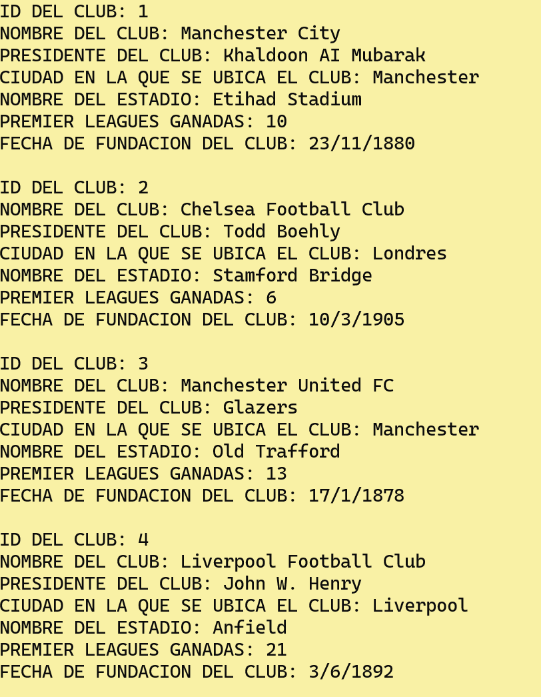
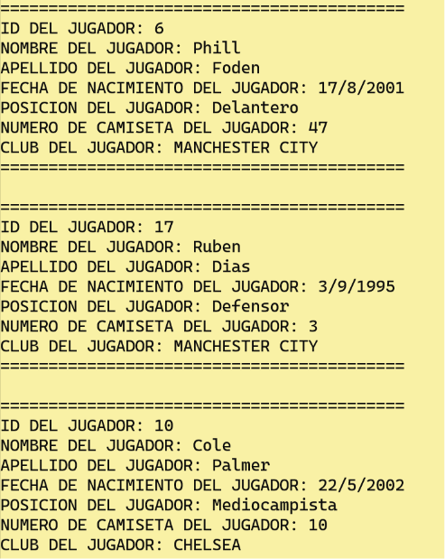
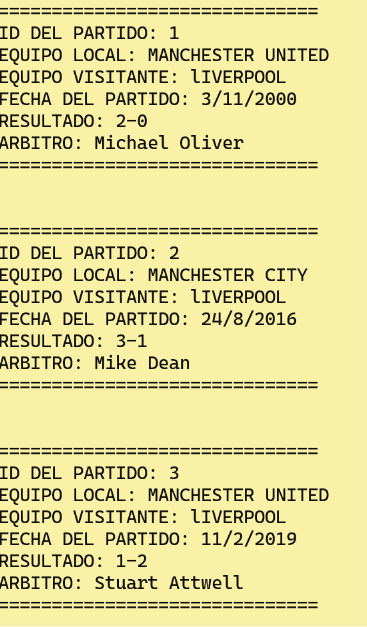

# Enfrentamientos Top 4 - Sistema de Gestión de Enfrentamientos de Tenis

Trabajo Práctico Integrador de la materia Programación II - Tecnicatura Universitaria en Programación (TUP), UTN FRGP. 2do cuatrimestre 2025.

## Objetivo

Sistema de escritorio para gestionar enfrentamientos de tenis entre clubes. Permite administrar clubes, jugadores y partidos, y organizar los enfrentamientos entre los distintos equipos.

## Tecnologías

- C++
- Programación estructurada
- Programación Orientada a Objetos (POO)
- Interfaz gráfica de escritorio

## Arquitectura

No se utilizó una arquitectura compleja como MVC o separación por capas. El proyecto se enfocó en aplicar los conceptos vistos durante la materia, organizando el código mediante funciones, clases y distintos módulos según la funcionalidad (clubes, jugadores, partidos).

## Fundamentos de programación aplicados

El desarrollo permitió integrar y aplicar los principales fundamentos de programación vistos durante la cursada:

* **Lógica de programación:** diseño de algoritmos y resolución de problemas.
* **Variables:** almacenamiento y manipulación de información.
* **Condicionales:** implementación de decisiones y validaciones.
* **Bucles:** repetición de procesos y recorrido de información.
* **Funciones:** modularización de código y reutilización de lógica.
* **Paso por valor y paso por referencia:** manejo de parámetros y modificación de datos.
* **Arrays:** almacenamiento y procesamiento de colecciones de elementos.
* **Programación Orientada a Objetos (POO):** modelado del dominio mediante clases y objetos.

## Funcionalidades principales

- Gestión de clubes
- Gestión de jugadores
- Gestión de partidos
- Organización de enfrentamientos entre equipos

## 📐 Diagrama de clases

El proyecto utiliza **Programación Orientada a Objetos (POO)** para modelar las principales entidades y relaciones del sistema.

## 🖥️ Vistas del proyecto

### Inicio del desarrollo

### Listado de clubes

### Listado de jugadores

### Listado de partidos

## Documentación

El informe completo del proyecto se encuentra disponible en el repositorio: [`Informe del proyecto`](./RUTA_A_COMPLETAR)

## Equipo

- Leonardo Farid Tello Moscoso
- Jean Oscar Paul Coria
- Thiago Pinza

---

# Enfrentamientos Top 4 - Tennis Match Management System

Final integrative project for Programación II - University Technician in Programming (TUP), UTN FRGP. Second semester 2025.

## Objective

Desktop system to manage tennis matches between clubs. Allows administration of clubs, players, and matches, and organizes matchups between teams.

## Technologies

- C++
- Structured programming
- Object-Oriented Programming (OOP)
- Desktop graphical interface

## Architecture

No complex architecture such as MVC or layer separation was used. The project focused on applying the concepts covered in the course, organizing the code through functions, classes, and modules based on functionality (clubs, players, matches).

## Programming fundamentals applied

The development allowed us to integrate and apply the main programming fundamentals studied throughout the course:

* **Programming logic:** algorithm design and problem solving.
* **Variables:** storage and manipulation of information.
* **Conditionals:** implementation of decisions and validations.
* **Loops:** repetition of processes and information traversal.
* **Functions:** code modularization and logic reuse.
* **Pass by value and pass by reference:** parameter handling and data modification.
* **Arrays:** storage and processing of collections of elements.
* **Object-Oriented Programming (OOP):** modeling the domain through classes and objects.

## Main features

- Club management
- Player management
- Match management
- Organization of matchups between teams

## 📐 Class diagram

The project uses **Object-Oriented Programming (OOP)** to model the main entities and relationships of the system.

## 🖥️ Project views

### Project development start

### Club list

### Player list

### Match list

## Documentation

The full project report is available in the repository: [`Project Report`](./RUTA_A_COMPLETAR)

## Team

- Leonardo Farid Tello Moscoso
- Jean Oscar Paul Coria
- Thiago Pinza

---

# ⭐ Calificación / Grade

**10/10**